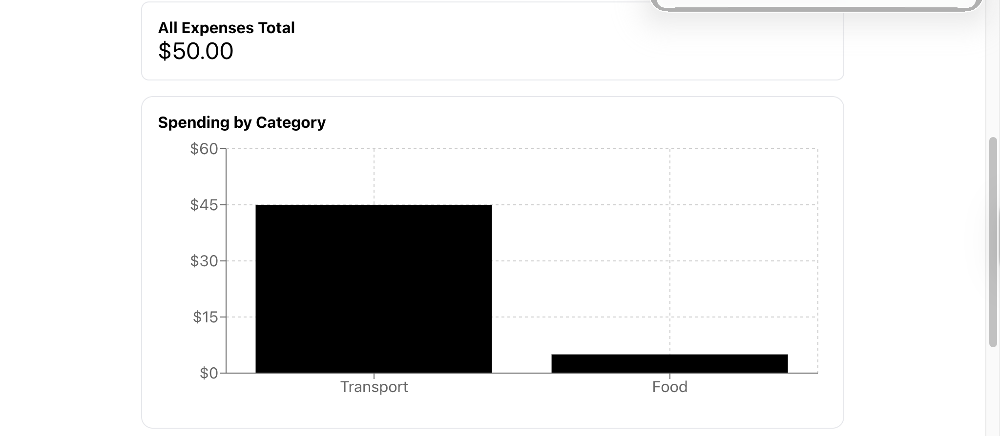
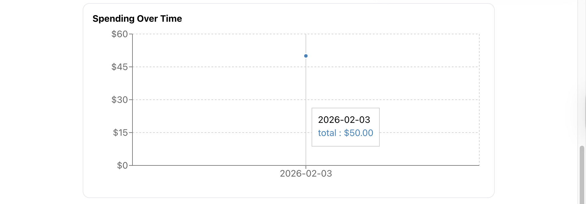
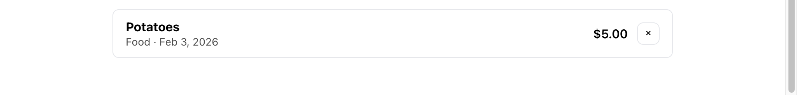

## 📊 Budget Tracker App

A polished, front-end–focused budget tracking application built with React, designed to showcase clean state management, data visualization, and thoughtful UX.

This project demonstrates how to take a simple idea and evolve it into a production-quality experience through iterative improvements.


> **Goal:** Showcase junior full-stack skills—component-driven UI, data flow, validation, and production-ready project structure.

## ✨ Features
- Add, categorize, and delete expenses
- Persistent data using localStorage
- Filter expenses by category
- Real-time spending summaries
- Interactive charts:
- Spending by category
- Spending over time
- 7 / 30 / All-time range toggle
- Accessible, keyboard-friendly form controls
- Toast notifications for user feedback
- Responsive layout with polished UI states

## 🔗 Live Demo
(Coming soon — deployment in progress)

## 🛠️ Tech Stack
- **React** (Hooks, functional components) 
- **Recharts** for data visualization  
- **CSS** (custom utility styles, no framework)
- **LocalStorage** for persistance

## 🧠 Design & Engineering Decisions
**State Management**

- App.jsx acts as the single source of truth for expenses
- Derived data (filters, totals, charts) is computed from base state
- Components are kept focused and reusable

**UX & Accessibility**

- Keyboard-first form interaction (autofocus, Enter flow)
- Disabled submit states prevent invalid actions
- Clear empty states that explain what to do next
- ARIA attributes and visible focus states for accessibility

**Data Visualization**

- Charts use derived, memoized data
- Time-based filtering implemented with useMemo
- Graceful handling of empty or invalid data

## 📈 What I Learned
- Structuring React components around responsibility boundaries
- Turning derived state into reusable, testable logic
- Improving UX through micro-interactions and feedback
- Debugging real-world React issues (props, rendering, scope)
- Designing features incrementally instead of over-engineering

## 📸 Screenshots





## 🚀 Getting Started
### Prerequisites
- Node.js (LTS recommended)
- npm

### Install dependencies
```bash
npm install
npm start
http://localhost:3000

# Example environment variables (do not put secrets in here)
# REACT_APP_API_URL=http://localhost:5000
