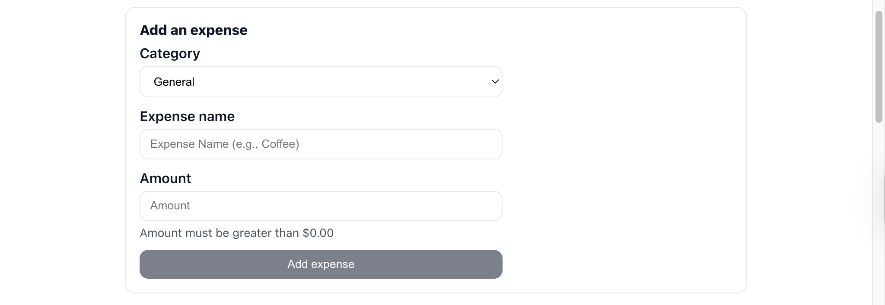
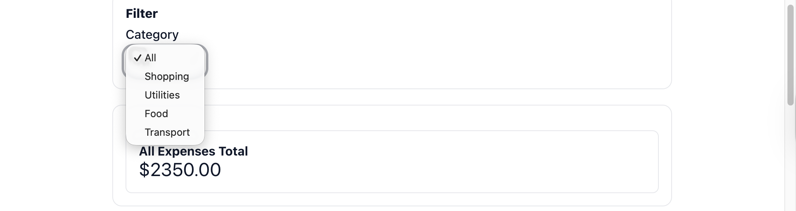

# Budget App (Full‑Stack)

A full‑stack personal budgeting application built with **React** on the frontend and **Python (FastAPI)** on the backend. The app allows users to manually track expenses, filter by category, and view spending summaries and charts. Data is persisted via a Python API and SQLite database.

This project was intentionally designed to demonstrate **clean frontend/backend separation**, real API design, and practical full‑stack architecture suitable for production‑style applications.

---

## ✨ Features

* Add, view, filter, and delete expenses
* Category-based filtering
* Backend-powered summaries and charts
* CSV import for bulk transactions
* Persistent storage via FastAPI + SQLite
* Clean, accessible UI with toast feedback

## 🔗 Live Demo: https://budget-app-lake-omega.vercel.app/


## 📸 Screenshots

| Dashboard | Add Expense | Filter and list |
|---|---|---|
|  |  |  | 


## 🧠 Architecture Overview

```
React (Frontend)
   │
   │  HTTP (JSON)
   ▼
FastAPI (Backend)
   │
   ▼
SQLite Database
```

* **Frontend (React)** handles UI, forms, filtering, and visualization
* **Backend (FastAPI)** owns data persistence, validation, and analytics
* **SQLite** provides lightweight, file‑based storage for development

This separation mirrors real‑world full‑stack applications and makes the system easy to extend (authentication, CSV import, ML categorization, etc.).

---

## 🧠 Architecture Overview

```text
React (Frontend – CRA)
  - UI, forms, filters, charts
  - Fetch-based API client

        HTTP / JSON

FastAPI (Backend)
  - Validation (Pydantic)
  - Business logic & analytics
  - REST API

        SQL

SQLite (Database)
  - expenses table
  - persistent local storage
```

The frontend is intentionally thin and presentation-focused. All aggregation, validation, and persistence logic lives in the backend, mirroring real-world production architecture.

---

## 🛠 Tech Stack

### Frontend

* React
* JavaScript (ES6+)
* HTML & CSS

### Backend

* Python 3.14
* FastAPI
* Pydantic (v2)
* SQLAlchemy
* SQLite

---

## 📡 API Endpoints

| Method | Endpoint                       | Description               |      |                 |
| ------ | ------------------------------ | ------------------------- | ---- | --------------- |
| GET    | `/expenses`                    | Fetch all expenses        |      |                 |
| POST   | `/expenses`                    | Create a new expense      |      |                 |
| DELETE | `/expenses/{id}`               | Delete an expense         |      |                 |
| GET    | `/insights/summary`            | Total, count, and average |      |                 |
| GET    | `/insights/by-category?range=7 | 30                        | all` | Category totals |
| GET    | `/insights/over-time?range=7   | 30                        | all` | Daily totals    |
| POST   | `/transactions/import`         | Import expenses from CSV  |      |                 |

Interactive API docs available at:

```
http://localhost:8000/docs
```

---

## 🚀 Running the Project Locally

### Prerequisites

* Node.js
* Python 3.11+

---

### Backend Setup

```bash
cd backend
python3 -m venv .venv
source .venv/bin/activate
pip install -r requirements.txt
python -m uvicorn main:app --reload --port 8000
```

Backend runs at:

```
http://localhost:8000
```

---

### Frontend Setup

```bash
npm install
npm start
```

Frontend runs at:

```
http://localhost:3000
```

---

## 🧪 Data Flow Example

1. User submits an expense in the React UI
2. React sends a `POST /expenses` request to FastAPI
3. FastAPI validates and stores the expense in SQLite
4. React fetches updated data via `GET /expenses`
5. Charts and summaries re‑render automatically

---

## 📈 Why This Project

This project was built as a **flagship portfolio application** to demonstrate practical full-stack engineering skills.

Key goals:

* Clear frontend/backend separation
* Backend-owned business logic
* Realistic API design
* Production-adjacent architecture

Rather than maximizing features, the focus was on building something **clean, extensible, and explainable in an interview setting**.

---

## 🔮 Future Improvements

* Authentication and multi-user support
* CSV column mapping and preview before import
* Monthly budgeting and goal tracking
* Automated category suggestions
* Test database isolation for CI
* Deployment with Docker and cloud hosting

---

## 🗣 Explaining This Project 

> “This is a full-stack budget tracking application built with React and a Python FastAPI backend. The frontend is responsible only for UI and user interaction, while all validation, persistence, and analytics logic lives in the backend.
>
> I started with a frontend-only prototype, then progressively moved business logic into the API, including summaries, category aggregation, and time-series analytics. The backend exposes clean REST endpoints and persists data in SQLite.
>
> I also added CSV import support to simulate real-world transaction ingestion, and implemented optimistic UI updates with backend-driven refreshes for a responsive user experience.”

---

## 👤 Author

**Michael Nobles**
Full-stack developer focused on clean architecture, clarity, and practical applications.

